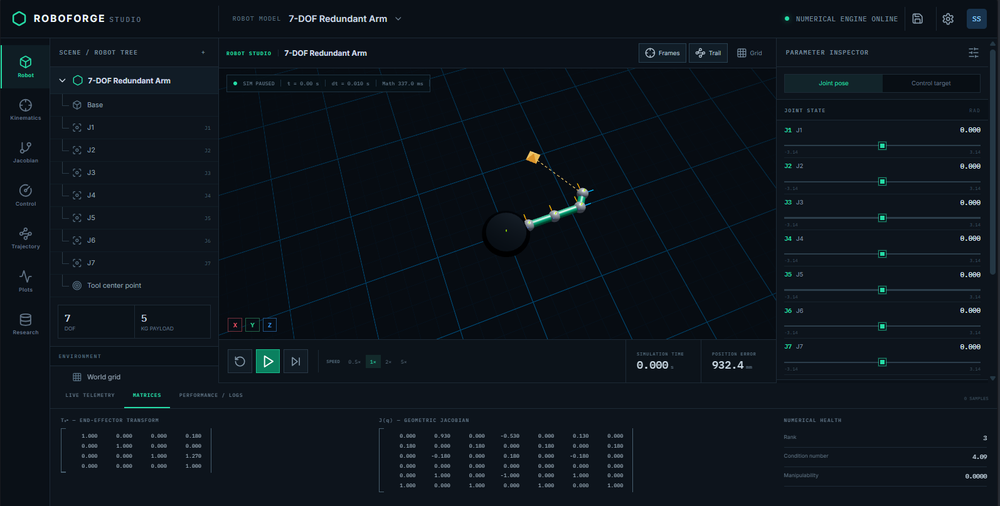

# RoboForge Studio

RoboForge Studio is a modular robotic-arm engineering and simulation platform built from the supplied research-platform specification. This release delivers a real, runnable foundation: the equations execute in the Python numerical engine, the React interface visualizes the computed state, and the simulation advances with a deterministic timestep.

Prepared for **Shivam Singh** · Version 1.0.0 · MIT licensed



## What is included

This package is an end-to-end Phase 1/Phase 2 implementation, not a collection of hard-coded demonstrations.

- Professional dark engineering workspace with a 3D viewport
- Five educational presets: 2-DOF, 3-DOF, SCARA, 6-DOF, and redundant 7-DOF
- Standard and modified Denavit–Hartenberg model support
- Real forward kinematics with every intermediate coordinate frame
- Numerical inverse kinematics using damped least squares and joint-limit enforcement
- Full spatial geometric Jacobian with rank, singular values, condition number, and manipulability
- Joint-space PID control with saturation, derivative action, persistent integral state, and anti-windup
- Deterministic simulation using Euler, semi-implicit Euler, or RK4 integration
- Linear, cubic, quintic, and minimum-jerk trajectory generation
- Live joint tracking plot, transform/Jacobian matrices, numerical warnings, and telemetry logs
- FastAPI REST endpoints, real-time WebSocket interface, validation, and descriptive error responses
- Plugin contracts for controllers, physics engines, sensors, and motion planners
- Docker and manual development workflows
- 13 automated reference and API tests

The larger product specification also describes dynamics, collision, sensor rendering, URDF, ROS 2, research sweeps, user accounts, and PostgreSQL persistence. Extension points are included for those capabilities, but they are explicitly listed as roadmap work rather than presented as finished features. See [Development roadmap](docs/DEVELOPMENT_ROADMAP.md).

## Interface at a glance

The screen is organized like professional robotics software:

| Area                | Purpose                                                                                         |
| ------------------- | ----------------------------------------------------------------------------------------------- |
| Left navigation     | Switch between robot, kinematics, Jacobian, control, trajectory, plots, and research workspaces |
| Robot tree          | Inspect the base, joints, tool frame, world, and IK target                                      |
| Central 3D viewport | Orbit, pan, zoom, inspect frames, follow the end-effector trail, and see the IK target          |
| Parameter inspector | Edit the current pose, set the controller target, tune PID gains, and solve IK                  |
| Playback strip      | Play, pause, single-step, reset, and change simulation speed                                    |
| Bottom laboratory   | Inspect telemetry, transformation/Jacobian matrices, rank, condition number, and logs           |

## Requirements

- Python 3.11 or newer
- Node.js 20 or newer and npm
- A modern WebGL-capable browser
- Optional: Docker Desktop with Docker Compose

## Fastest start

### Windows

Double-click `start-windows.bat`, or run it from Command Prompt:

```bat
start-windows.bat
```

The script creates a Python virtual environment, installs backend and frontend dependencies, starts the API, and starts the web interface.

### Linux or macOS

```bash
chmod +x start-linux.sh
./start-linux.sh
```

Open <http://localhost:5173>. The interactive API documentation is at <http://localhost:8000/docs>.

## Docker start

From the project root:

```bash
docker compose up --build
```

Then open:

- Application: <http://localhost:5173>
- Swagger API: <http://localhost:8000/docs>
- Health check: <http://localhost:8000/api/health>

Stop the stack with `Ctrl+C`, followed by `docker compose down` if needed.

## Manual development setup

Use two terminals.

Terminal 1 — numerical backend:

```bash
cd backend
python -m venv .venv
```

Activate the environment:

```bash
# Windows PowerShell
.venv\Scripts\Activate.ps1

# Linux/macOS
source .venv/bin/activate
```

Install and start:

```bash
python -m pip install -r requirements.txt
python -m uvicorn app.main:app --reload --port 8000
```

Terminal 2 — engineering interface:

```bash
cd frontend
npm install
npm run dev
```

## First experiment

1. Choose **2-DOF Planar Arm** from the top robot selector.
2. Keep **Joint pose** selected and drag J1 or J2. The frontend requests a new FK solution; the robot, coordinate frames, end-effector transform, and Jacobian update from the returned numerical result.
3. Select **Control target** and set a different position for each joint.
4. Press Play. The PID controller produces torque, the integrator advances the state, and actual position moves toward the target.
5. Tune `KP`, `KI`, and `KD` while the simulation runs and inspect the response under **Live telemetry**.
6. Enter an X/Y/Z target and click **Solve inverse kinematics**. The DLS solver reports convergence, iteration count, and residual error.
7. Open **Matrices** to inspect the current homogeneous transform and the full geometric Jacobian.

## Keyboard shortcuts

| Shortcut | Action                         |
| -------- | ------------------------------ |
| `Space`  | Play or pause                  |
| `R`      | Reset simulation               |
| `S`      | Advance one deterministic step |
| `A`      | Toggle coordinate frames       |
| `T`      | Toggle end-effector trail      |

The specification reserves `F`, `G`, `C`, `I`, `D`, `P`, and `Ctrl+S` for future workspaces.

## Mathematics that executes

For standard DH parameters, joint transform `i` is evaluated as

$$
{}^{i-1}T_i = R_z(\theta_i)\,T_z(d_i)\,T_x(a_i)\,R_x(\alpha_i).
$$

Forward kinematics multiplies every joint transform:

$$
{}^0T_n = {}^0T_1{}^1T_2\cdots{}^{n-1}T_n.
$$

The spatial geometric Jacobian uses the world-space axis $z_{i-1}$ and origin $o_{i-1}$. For a revolute joint,

$$
J_{v_i}=z_{i-1}\times(o_n-o_{i-1}),\qquad J_{\omega_i}=z_{i-1}.
$$

Position IK uses a damped pseudoinverse step:

$$
\Delta q = J_v^T(J_vJ_v^T+\lambda^2I)^{-1}(x_d-x).
$$

The controller computes

$$
\tau=K_pe+K_i\int e\,dt-K_d\dot q,
$$

and the included educational plant integrates the decoupled rigid-body approximation

$$
M\ddot q+D\dot q=\tau.
$$

This plant is intentionally documented as an educational approximation. The `PhysicsEngine` interface is where a coupled recursive dynamics or external MuJoCo/PyBullet engine can be connected without changing the UI. See [Mathematics and numerical safeguards](docs/MATHEMATICS.md).

## REST API

Important endpoints:

| Method     | Path                       | Purpose                                       |
| ---------- | -------------------------- | --------------------------------------------- |
| `GET`      | `/api/robots/presets`      | Get the five supplied robots                  |
| `GET/POST` | `/api/robots`              | List or create robot models                   |
| `GET/PUT`  | `/api/robots/{id}`         | Read or update a robot                        |
| `POST`     | `/api/kinematics/fk`       | Compute pose and intermediate frames          |
| `POST`     | `/api/kinematics/ik`       | Solve joint-limited position IK               |
| `POST`     | `/api/jacobian`            | Calculate Jacobian and singularity metrics    |
| `POST`     | `/api/trajectory/generate` | Generate a sampled joint trajectory           |
| `POST`     | `/api/simulation/step`     | Advance state by an exact number of timesteps |
| `WS`       | `/ws/simulation`           | Stream simulation state in real time          |

Example FK call:

```bash
curl -X POST http://localhost:8000/api/kinematics/fk \
  -H "Content-Type: application/json" \
  --data @examples/fk-request.json
```

FastAPI exposes complete interactive request/response schemas at `/docs` and `/redoc`.

## Tests and verification

Backend:

```bash
cd backend
python -m pytest -q
```

Frontend type check and production build:

```bash
cd frontend
npm run build
```

The test suite checks:

- DH matrix output against a known reference
- 2-DOF FK at zero and 90 degrees
- analytical Jacobian against finite differences
- IK convergence and residual position error
- invalid vector validation
- quintic boundary conditions
- constant-velocity linear trajectories
- PID saturation
- deterministic simulation time and target tracking
- API health, FK response, and descriptive error handling

## Project structure

```text
roboforge-studio/
├── frontend/
│   ├── src/
│   │   ├── api/              # Typed API client
│   │   ├── components/       # 3D viewport, matrix, telemetry
│   │   ├── types/            # Shared frontend contracts
│   │   ├── App.tsx           # Engineering workspace composition
│   │   └── styles.css        # High-density engineering theme
│   └── package.json
├── backend/
│   ├── app/
│   │   ├── api/              # REST routes
│   │   ├── controllers/      # Controller contract and PID
│   │   ├── core/             # Settings
│   │   ├── kinematics/       # DH, FK, IK, Jacobian
│   │   ├── models/           # Validated Pydantic contracts
│   │   ├── physics/          # Physics backend abstraction
│   │   ├── planning/         # Motion-planner abstraction
│   │   ├── robots/           # Educational presets
│   │   ├── sensors/          # Sensor/noise abstraction
│   │   ├── simulation/       # Deterministic simulation engine
│   │   └── trajectory/       # Polynomial trajectory generator
│   └── tests/                # Numerical and API regression tests
├── docs/                     # Architecture, mathematics, roadmap
├── docker-compose.yml
├── start-linux.sh
└── start-windows.bat
```

## Design rules for extending the platform

1. Keep numerical algorithms in the Python backend; React should visualize results and collect engineering inputs.
2. Add a Pydantic request/response model before adding an endpoint.
3. Implement controllers through the common `Controller` contract.
4. Implement external simulators through `PhysicsEngine`; do not bind the user interface to one engine.
5. Advance simulation time by `simulation_time += dt`; wall-clock time is only for pacing.
6. Reject NaN/Inf, invalid dimensions, invalid limits, and non-convergent solvers with visible messages.
7. Add known-reference and numerical-regression tests for every algorithm.

## Troubleshooting

**The interface says “Backend offline.”** Verify that `http://localhost:8000/api/health` returns JSON, and ensure the API is running before opening the frontend.

**PowerShell blocks virtual-environment activation.** Run `Set-ExecutionPolicy -Scope Process Bypass`, then activate the environment again, or use `start-windows.bat` from Command Prompt.

**The 3D area is blank.** Update the graphics driver and enable hardware acceleration/WebGL in the browser.

**An IK target is unreachable.** Try a point inside the robot’s total link reach, move away from a singular starting pose, or increase damping slightly in the request.

**Port 5173 or 8000 is already in use.** Stop the conflicting process, or choose different ports and update `VITE_API_URL`.

## License

MIT. See [LICENSE](LICENSE).
