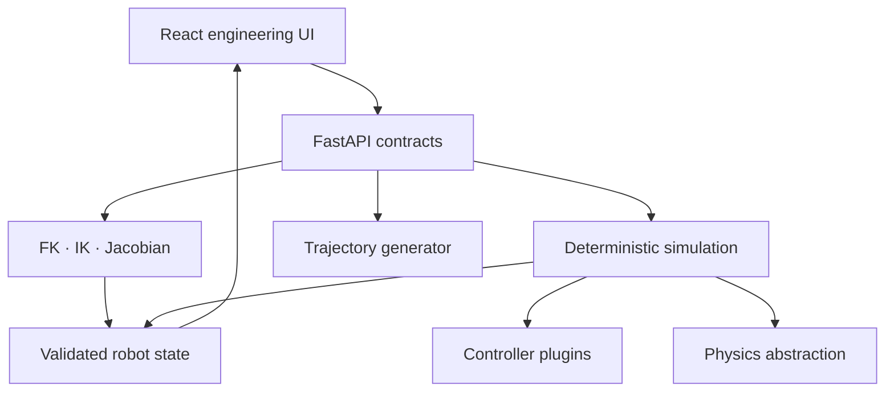
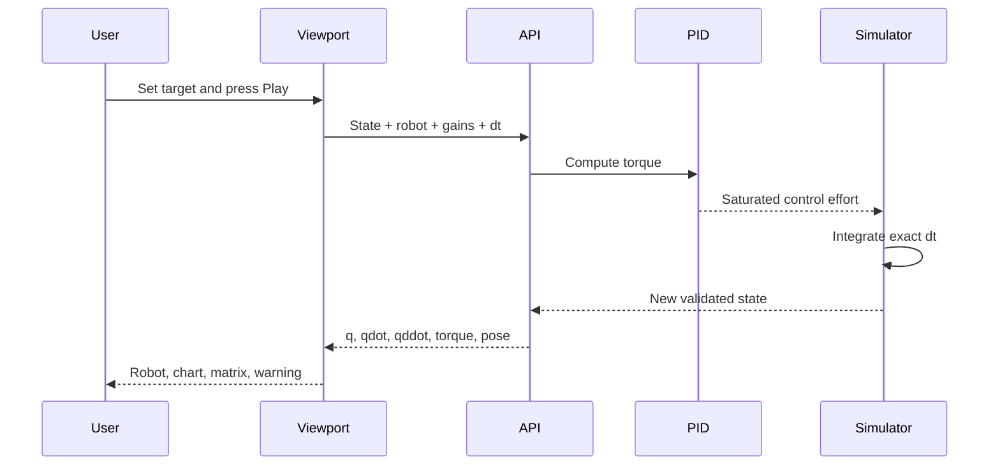

# Architecture

## Purpose

RoboForge separates the engineering interface, validated API contracts, numerical algorithms, deterministic state, and future physics backends. This prevents UI components from becoming the source of truth for robotics mathematics.

## Frontend

The frontend owns interaction and visualization only.

- `App.tsx` composes the screen and manages user interaction.
- `api/client.ts` is the single network boundary.
- `RobotViewport.tsx` draws world-space frames returned by FK. It does not independently solve FK.
- `TelemetryChart.tsx` displays samples generated from simulation state.
- `MatrixView.tsx` presents exact backend matrices.
- `types/robot.ts` mirrors public API contracts.

State transitions are explicit. Editing **Joint pose** changes the state to analyze. Editing **Control target** changes the controller reference. The simulation endpoint then advances the state by an exact number of `dt` steps.

## Backend

The backend is organized by engineering responsibility.

| Package | Responsibility |
| --- | --- |
| `models` | Pydantic validation and API contracts |
| `robots` | Preset and future plugin robot definitions |
| `kinematics` | DH transforms, FK, IK, Jacobian, pose conversion |
| `controllers` | Common controller interface and PID implementation |
| `trajectory` | Time-normalized trajectory generation |
| `simulation` | Deterministic loop, limits, integration, telemetry |
| `physics` | Neutral interface for higher-fidelity backends |
| `sensors` | Sampling and configurable measurement noise |
| `planning` | Neutral interface for RRT/PRM/A* implementations |
| `api` | HTTP translation and error mapping |

## Simulation data flow

## Extension interfaces

### Controller

Every controller implements:

- `reset()`
- `compute_control(target, position, velocity, dt)`
- `get_parameters()`

Register new controllers in `controllers/plugins.py`. Computed torque, impedance, MPC, sliding mode, and learned controllers can use the same boundary.

### Physics engine

Every physics backend implements:

- `initialize(robot)`
- `step(dt)`
- `apply_force(body_id, force)`
- `apply_torque(joint_id, torque)`
- `detect_collisions()`
- `get_state()`

This boundary is intended for MuJoCo, PyBullet, Gazebo, or custom rigid-body dynamics.

### Sensors and planners

`Sensor.sample()` owns sensor output. `NoiseModel` provides Gaussian noise, bias, and drift. `MotionPlanner.plan()` owns collision-aware path generation. Both are deliberately backend-neutral.

## Production hardening

Before a public multi-user deployment, add PostgreSQL persistence, authentication, authorization, ownership checks, rate limiting, secure mesh validation, background experiment workers, observability, and migration tooling. These are roadmap items and are not hidden behind placeholder UI in this release.

